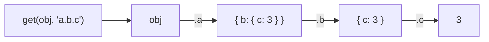
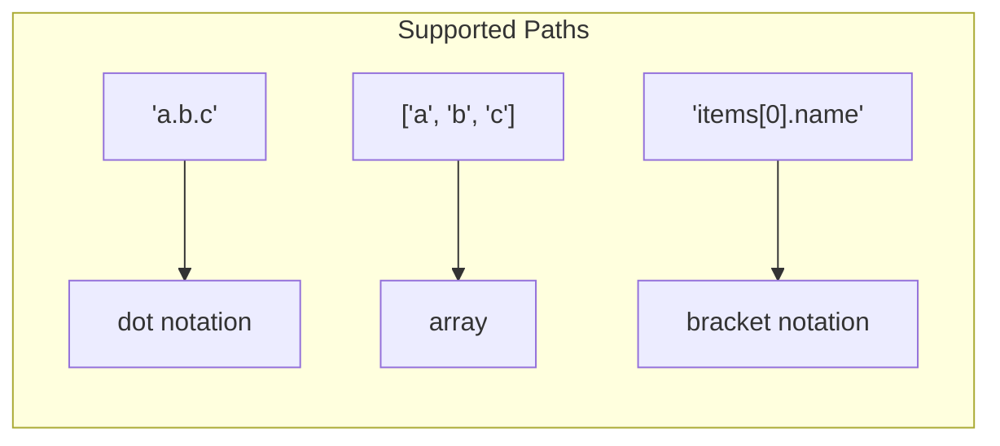
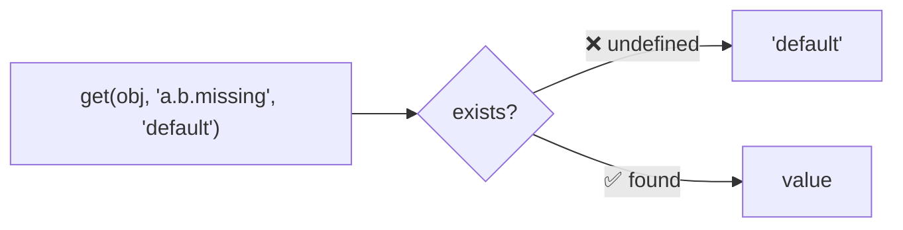
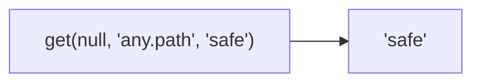

Safely retrieves a value at a nested path with optional default.

```mermaid
flowchart LR
    A["get(obj, 'a.b.c')"] --> B["obj"]
    B -->|".a"| C["{ b: { c: 3 } }"]
    C -->|".b"| D["{ c: 3 }"]
    D -->|".c"| E["3"]
```

### Path Formats

```mermaid
flowchart LR
    subgraph "Supported Paths"
        A["'a.b.c'"] --> R["dot notation"]
        B["['a', 'b', 'c']"] --> S["array"]
        C["'items[0].name'"] --> T["bracket notation"]
    end
```

### Default Value

```mermaid
flowchart LR
    A["get(obj, 'a.b.missing', 'default')"] --> B{"exists?"}
    B -->|"❌ undefined"| C["'default'"]
    B -->|"✅ found"| D["value"]
```

### Null Safety

```mermaid
flowchart LR
    A["get(null, 'any.path', 'safe')"] --> B["'safe'"]
```
