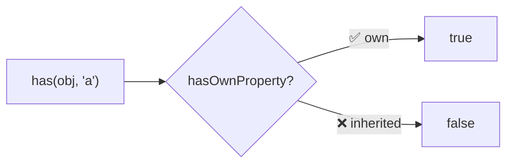
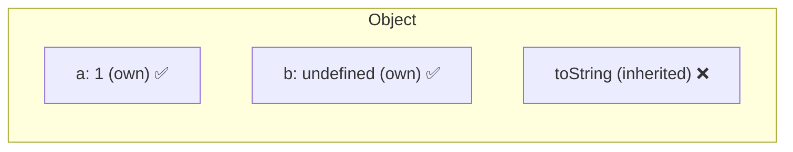
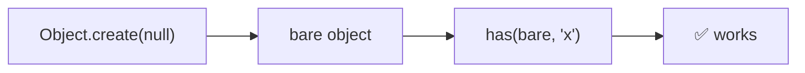

Checks if an object has a property as its own (not inherited).

### Own vs Inherited

### Works with Object.create(null)

Unlike `obj.hasOwnProperty()`, `has()` works even when the prototype chain is broken.
