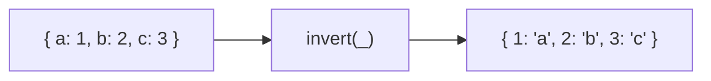
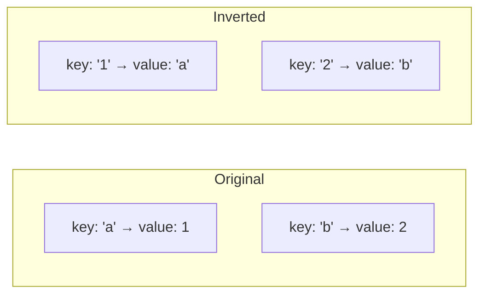
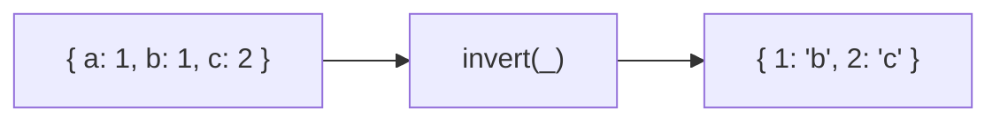
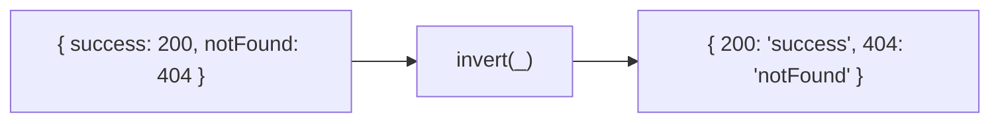

Creates a new object by swapping keys and values.

```mermaid
flowchart LR
    A["{ a: 1, b: 2, c: 3 }"] --> B["invert(_)"]
    B --> C["{ 1: 'a', 2: 'b', 3: 'c' }"]
```

### Key-Value Swap

```mermaid
flowchart LR
    subgraph "Original"
        A["key: 'a' → value: 1"]
        B["key: 'b' → value: 2"]
    end
    subgraph "Inverted"
        C["key: '1' → value: 'a'"]
        D["key: '2' → value: 'b'"]
    end
```

### Duplicate Values

When values are duplicated, the last key wins:

```mermaid
flowchart LR
    A["{ a: 1, b: 1, c: 2 }"] --> B["invert(_)"]
    B --> C["{ 1: 'b', 2: 'c' }"]
```

### Use Case: Lookup Table

```mermaid
flowchart LR
    A["{ success: 200, notFound: 404 }"] --> B["invert(_)"]
    B --> C["{ 200: 'success', 404: 'notFound' }"]
```
