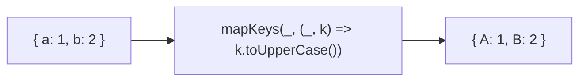
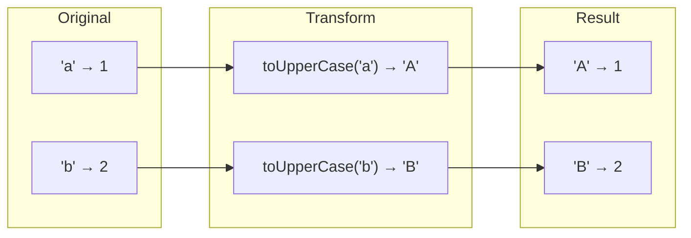
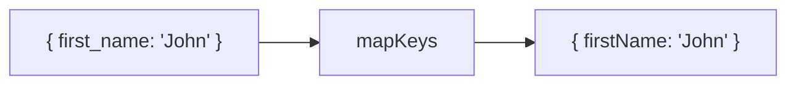

Creates a new object with keys transformed by a function.

```mermaid
flowchart LR
    A["{ a: 1, b: 2 }"] --> B["mapKeys(_, (_, k) => k.toUpperCase())"]
    B --> C["{ A: 1, B: 2 }"]
```

### Transformation Flow

```mermaid
flowchart LR
    subgraph "Original"
        A["'a' → 1"]
        B["'b' → 2"]
    end
    subgraph "Transform"
        C["toUpperCase('a') → 'A'"]
        D["toUpperCase('b') → 'B'"]
    end
    subgraph "Result"
        E["'A' → 1"]
        F["'B' → 2"]
    end
    A --> C --> E
    B --> D --> F
```

### snake_case to camelCase

```mermaid
flowchart LR
    A["{ first_name: 'John' }"] --> B["mapKeys"]
    B --> C["{ firstName: 'John' }"]
```
