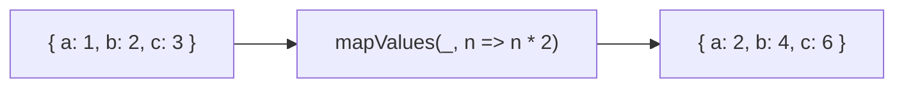
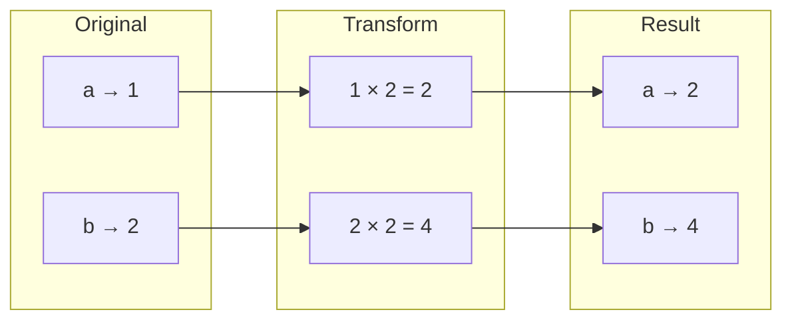
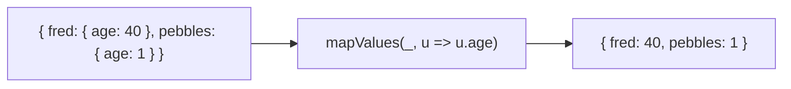

Creates a new object with values transformed by a function.

```mermaid
flowchart LR
    A["{ a: 1, b: 2, c: 3 }"] --> B["mapValues(_, n => n * 2)"]
    B --> C["{ a: 2, b: 4, c: 6 }"]
```

### Transformation Flow

```mermaid
flowchart LR
    subgraph "Original"
        A["a → 1"]
        B["b → 2"]
    end
    subgraph "Transform"
        C["1 × 2 = 2"]
        D["2 × 2 = 4"]
    end
    subgraph "Result"
        E["a → 2"]
        F["b → 4"]
    end
    A --> C --> E
    B --> D --> F
```

### Extract Nested Values

```mermaid
flowchart LR
    A["{ fred: { age: 40 }, pebbles: { age: 1 } }"] --> B["mapValues(_, u => u.age)"]
    B --> C["{ fred: 40, pebbles: 1 }"]
```
