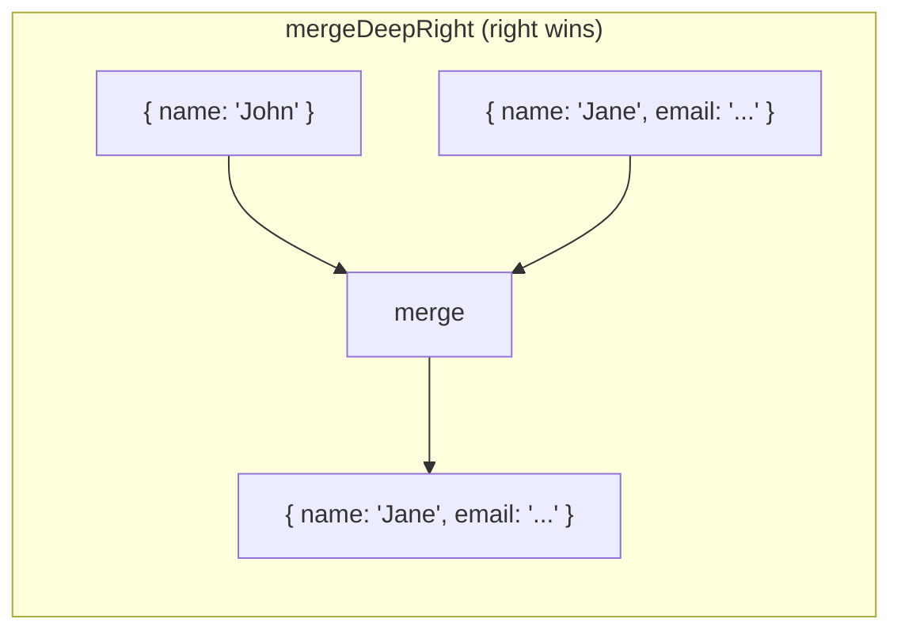
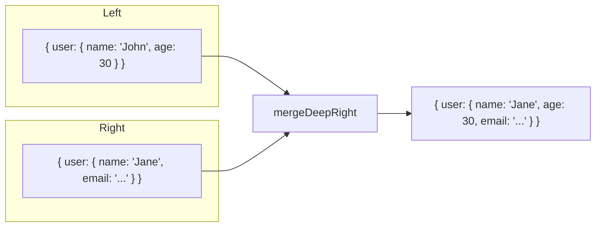
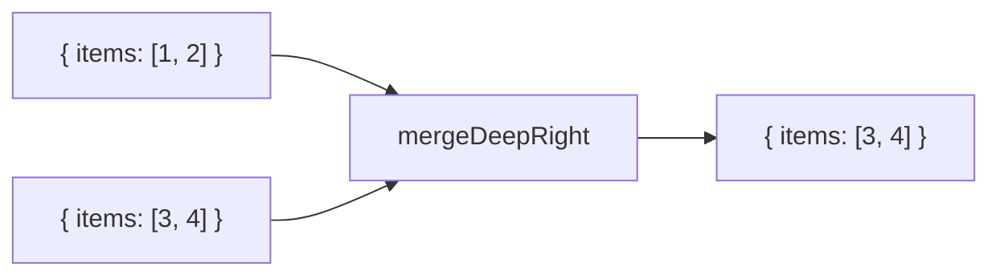

Recursively merges objects with configurable precedence.

```mermaid
flowchart LR
    subgraph "mergeDeepLeft (left wins)"
        A1["{ name: 'John' }"] --> M1["merge"]
        B1["{ name: 'Jane', email: '...' }"] --> M1
        M1 --> C1["{ name: 'John', email: '...' }"]
    end
```

```mermaid
flowchart LR
    subgraph "mergeDeepRight (right wins)"
        A2["{ name: 'John' }"] --> M2["merge"]
        B2["{ name: 'Jane', email: '...' }"] --> M2
        M2 --> C2["{ name: 'Jane', email: '...' }"]
    end
```

### Recursive Merge

```mermaid
flowchart LR
    subgraph "Left"
        L["{ user: { name: 'John', age: 30 } }"]
    end
    subgraph "Right"
        R["{ user: { name: 'Jane', email: '...' } }"]
    end
    L --> M["mergeDeepRight"]
    R --> M
    M --> O["{ user: { name: 'Jane', age: 30, email: '...' } }"]
```

### Arrays Are Replaced

```mermaid
flowchart LR
    A["{ items: [1, 2] }"] --> M["mergeDeepRight"]
    B["{ items: [3, 4] }"] --> M
    M --> C["{ items: [3, 4] }"]
```
