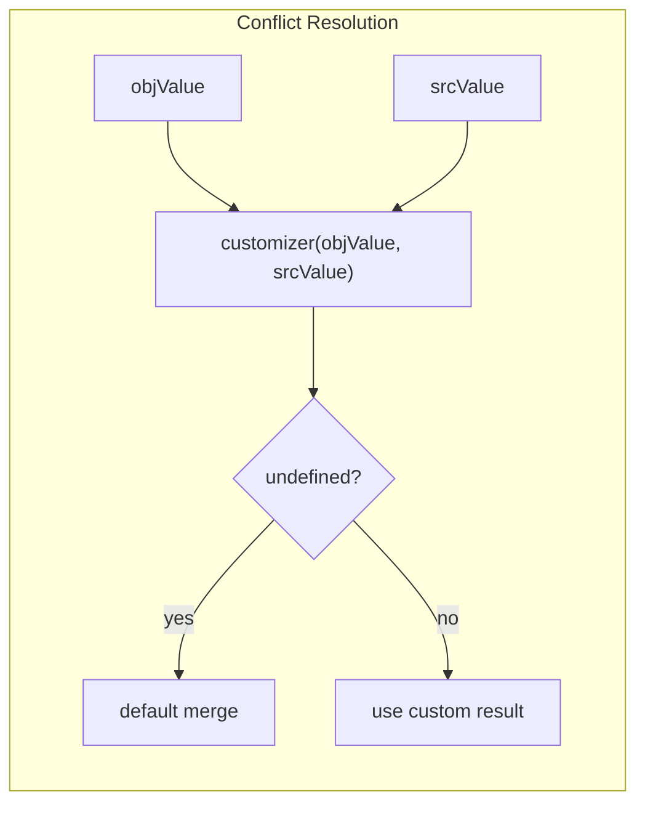
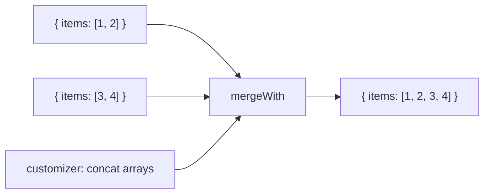
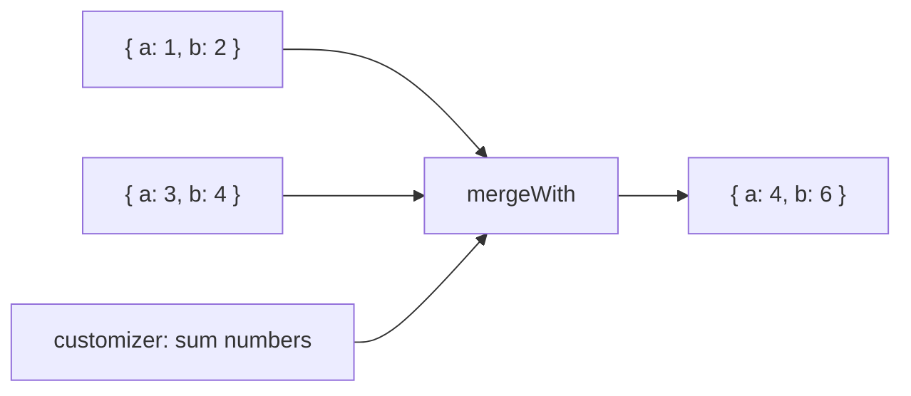

Recursively merges objects using a customizer to resolve conflicts.

### Array Concatenation

### Sum Values

### mergeDeep vs mergeWith

| | mergeDeep | mergeWith |
|--|-----------|-----------|
| **Customization** | None | Full control |
| **Arrays** | Replace | Customizable |
| **Conflicts** | Left/Right wins | Custom logic |
