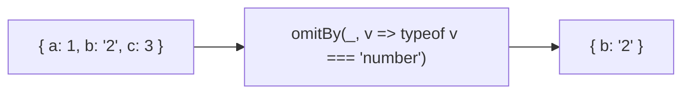
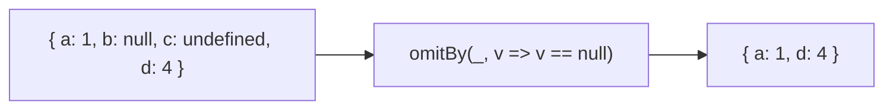
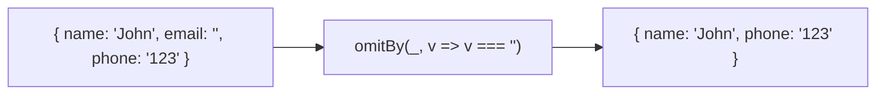

Creates a new object excluding properties that satisfy a predicate.

### Remove Null Values

### Remove Empty Strings

### pickBy vs omitBy

| | pickBy | omitBy |
|--|--------|--------|
| **Keeps if** | predicate = true | predicate = false |
| **Logic** | Whitelist | Blacklist |
