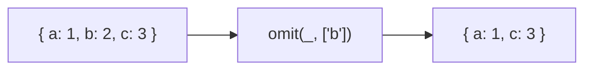
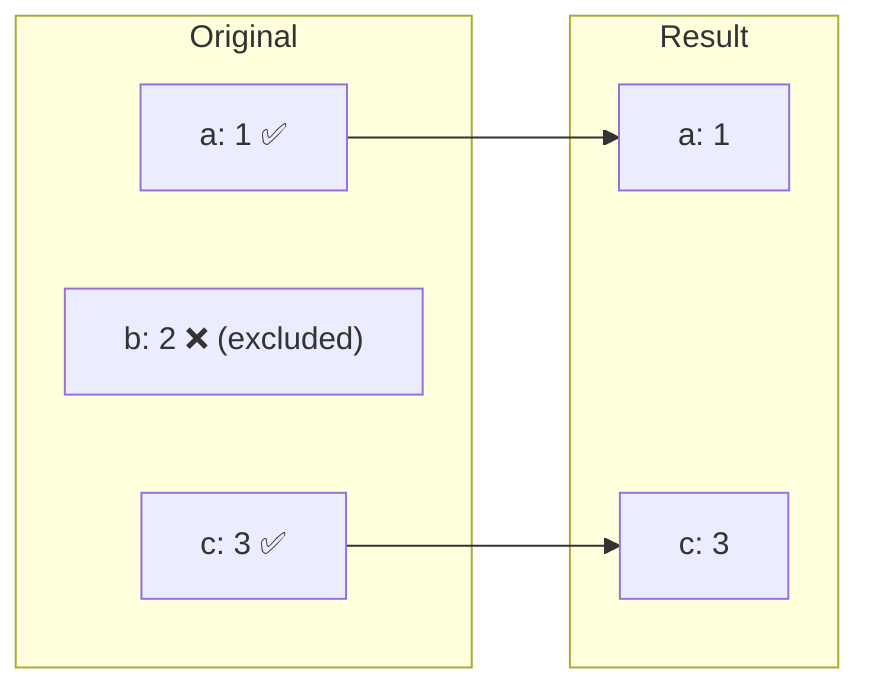
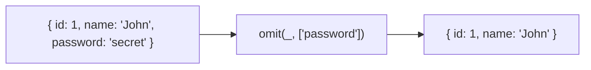

Creates a new object excluding the specified keys.

```mermaid
flowchart LR
    A["{ a: 1, b: 2, c: 3 }"] --> B["omit(_, ['b'])"]
    B --> C["{ a: 1, c: 3 }"]
```

### Exclusion Process

```mermaid
flowchart LR
    subgraph "Original"
        A["a: 1 ✅"]
        B["b: 2 ❌ (excluded)"]
        C["c: 3 ✅"]
    end
    subgraph "Result"
        D["a: 1"]
        E["c: 3"]
    end
    A --> D
    C --> E
```

### Sensitive Data Removal

```mermaid
flowchart LR
    A["{ id: 1, name: 'John', password: 'secret' }"] --> B["omit(_, ['password'])"]
    B --> C["{ id: 1, name: 'John' }"]
```
