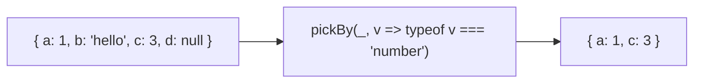
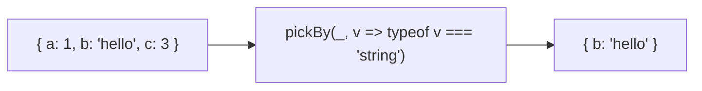
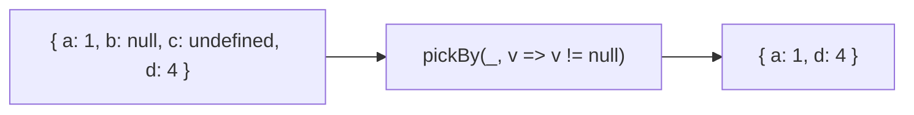

Creates a new object with properties that satisfy a predicate.

### Filter by Type

### Filter Non-Null

### pick vs pickBy

| | pick | pickBy |
|--|------|--------|
| **Selects by** | Key names | Predicate function |
| **Use case** | Known keys | Dynamic filtering |
