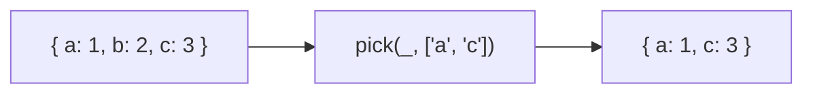
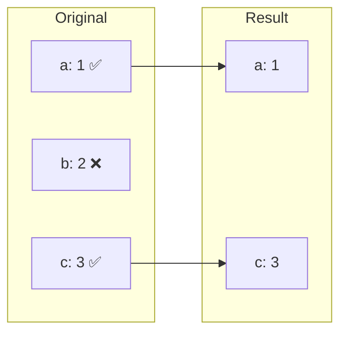

Creates a new object with only the specified keys.

### Selection Process

### pick vs omit

| | pick | omit |
|--|------|------|
| **Keeps** | specified keys | all except specified |
| **Use case** | whitelist | blacklist |
