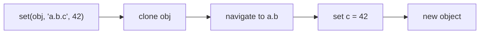
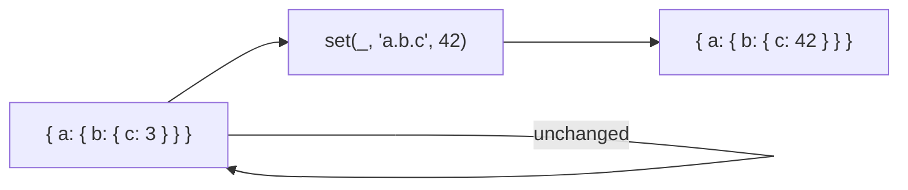
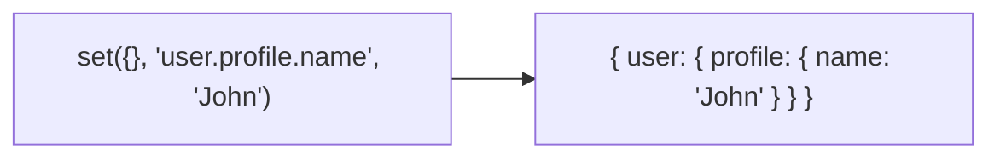
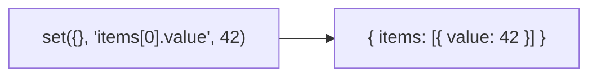

Immutably sets a value at a nested path, returning a new object.

```mermaid
flowchart LR
    A["set(obj, 'a.b.c', 42)"] --> B["clone obj"]
    B --> C["navigate to a.b"]
    C --> D["set c = 42"]
    D --> E["new object"]
```

### Immutability

```mermaid
flowchart LR
    A["{ a: { b: { c: 3 } } }"] --> B["set(_, 'a.b.c', 42)"]
    B --> C["{ a: { b: { c: 42 } } }"]
    A -->|"unchanged"| A
```

### Auto-Creation

Creates intermediate objects/arrays as needed:

```mermaid
flowchart LR
    A["set({}, 'user.profile.name', 'John')"] --> B["{ user: { profile: { name: 'John' } } }"]
```

### Array Creation

```mermaid
flowchart LR
    A["set({}, 'items[0].value', 42)"] --> B["{ items: [{ value: 42 }] }"]
```
