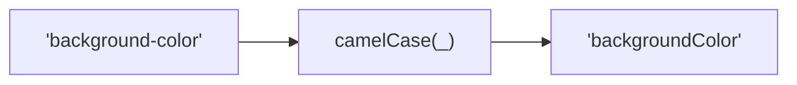
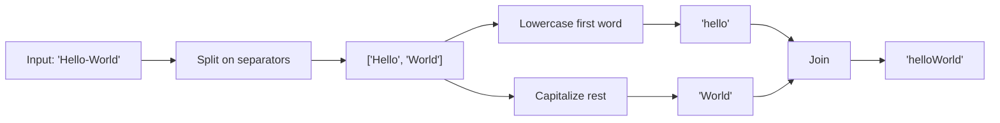

Converts a string to camelCase format.
First word lowercase, subsequent words capitalized, no separators.

### Conversion Examples

| Input | Output |
|-------|--------|
| `background-color` | `backgroundColor` |
| `font_size` | `fontSize` |
| `Hello World` | `helloWorld` |
| `PascalCase` | `pascalCase` |
| `HTTPRequest` | `httpRequest` |

### Process

