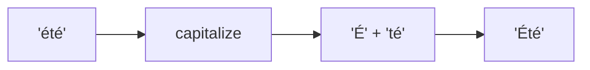

Converts the first character to uppercase and the rest to lowercase.

### Examples

| Input | Output |
|-------|--------|
| `hello` | `Hello` |
| `HELLO` | `Hello` |
| `été` | `Été` |
| `москва` | `Москва` |

### Unicode Support

Supports Unicode characters (accents, Cyrillic, etc.).
