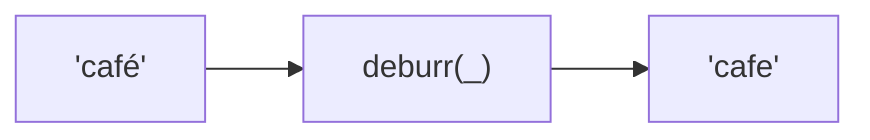
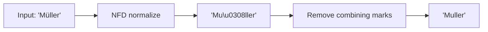

Removes diacritical marks and converts ligatures to basic Latin letters.

### Process

### Ligature Expansion

| Input | Output |
|-------|--------|
| `œ` | `oe` |
| `æ` | `ae` |
| `ß` | `ss` |
| `Þ` | `Th` |
| `Ø` | `O` |

### Examples

| Input | Output |
|-------|--------|
| `café` | `cafe` |
| `Müller` | `Muller` |
| `Straße` | `Strasse` |
| `Œuvre` | `OEuvre` |
| `Þór` | `Thor` |
| `Łódź` | `Lodz` |
