Escapes RegExp special characters in a string.
Makes user input safe for use in regex patterns.


### Escaped Characters

```
^ $ \ . * + ? ( ) [ ] { } |
```

### Use Case: Safe Pattern


### Without Escaping

```mermaid
flowchart LR
    A["'hello.*world'"] --> B["new RegExp(_)"]
    B --> C["Matches 'helloXXXworld' ❌"]
```



Without escaping, `.` matches any character and `*` is a quantifier.
