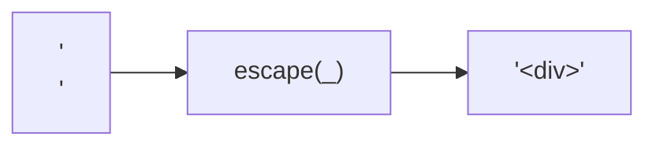
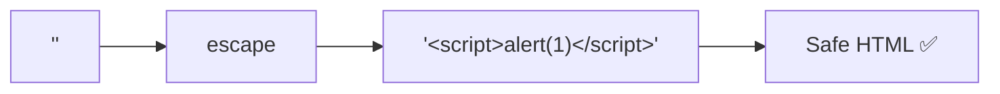
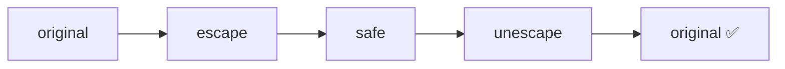

Escapes HTML special characters to their corresponding entities.
Essential for XSS prevention.

### Character Mapping

| Character | Entity |
|-----------|--------|
| `&` | `&amp;` |
| `<` | `&lt;` |
| `>` | `&gt;` |
| `"` | `&quot;` |
| `'` | `&#39;` |

### XSS Prevention

### Roundtrip with unescape

