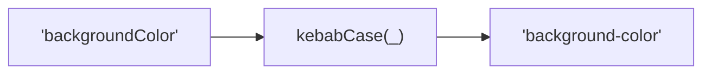
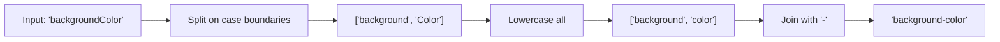

Converts a string to kebab-case format.
All lowercase, words separated by hyphens.

### Conversion Examples

| Input | Output |
|-------|--------|
| `backgroundColor` | `background-color` |
| `XMLHttpRequest` | `xml-http-request` |
| `hello world` | `hello-world` |
| `foo_bar` | `foo-bar` |

### Process

