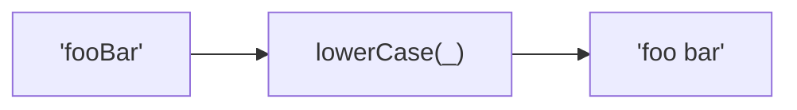
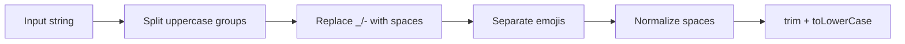

Converts string to space-separated lowercase words.
Splits on case boundaries, underscores, hyphens, and emojis. Supports Unicode.

### Conversion Examples

| Input | Output |
|-------|--------|
| `'--Foo-Bar--'` | `'foo bar'` |
| `'fooBar'` | `'foo bar'` |
| `'__FOO_BAR__'` | `'foo bar'` |
| `'ÑoñoCase'` | `'ñoño case'` |

### Process

