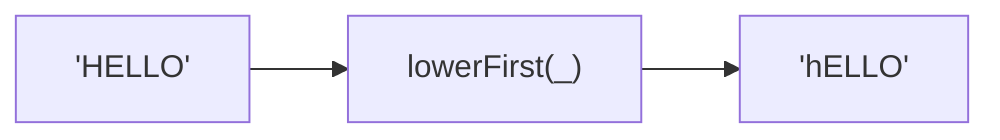

Converts only the first character to lowercase.
Rest of the string is preserved unchanged.

### Examples

| Input | Output |
|-------|--------|
| `Hello` | `hello` |
| `HELLO` | `hELLO` |
| `Été` | `été` |

### lowerFirst vs capitalize

| Function | `'HELLO'` |
|----------|-----------|
| `lowerFirst` | `hELLO` |
| `capitalize` | `Hello` |

`lowerFirst` only changes the first character.
