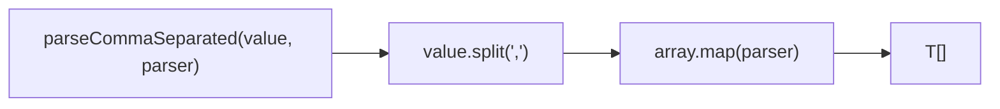
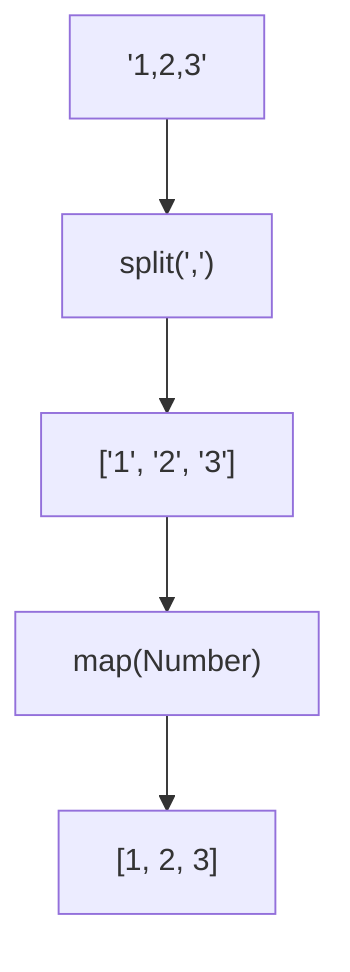

Parses a comma-separated string using a custom parser function.

### Processing Flow

### Common Inputs

| Value | Parser | Result |
|-------|--------|--------|
| `'1,2,3'` | `Number` | `[1, 2, 3]` |
| `'a,b,c'` | `x => x.toUpperCase()` | `['A', 'B', 'C']` |
| `' a , b '` | `x => x.trim()` | `['a', 'b']` |
| `''` | `x => x` | `['']` |
