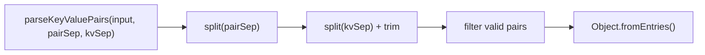
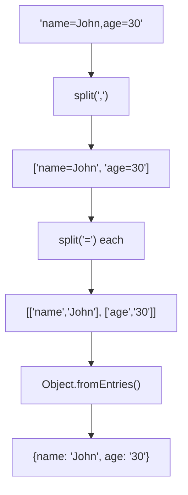

Parses a string containing key-value pairs into an object.

### Processing Flow

### Common Inputs

| Input | Pair Sep | KV Sep | Result |
|-------|----------|--------|--------|
| `'name=John,age=30'` | `,` | `=` | `{name: 'John', age: '30'}` |
| `'name:John;age:30'` | `;` | `:` | `{name: 'John', age: '30'}` |
| `'key=value&other=data'` | `&` | `=` | `{key: 'value', other: 'data'}` |
| `' name = John '` | `,` | `=` | `{name: 'John'}` |
