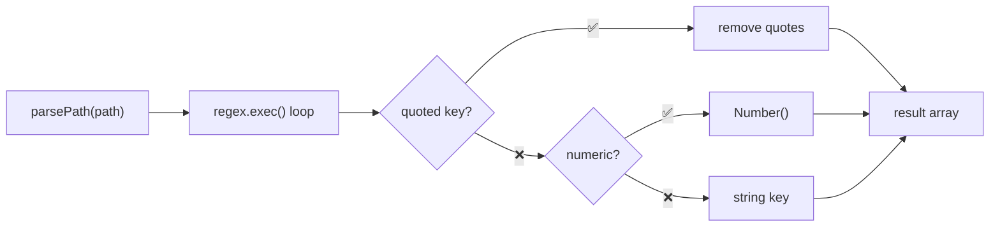
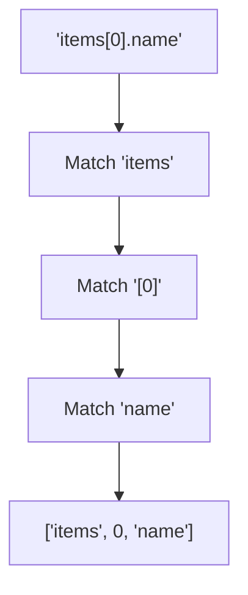

Parses a path string into an array of keys for object property access.

### Processing Flow

### Supported Notations

| Path | Result |
|------|--------|
| `'a.b.c'` | `['a', 'b', 'c']` |
| `'items[0].name'` | `['items', 0, 'name']` |
| `'data[1][2].value'` | `['data', 1, 2, 'value']` |
| `'obj["key"].value'` | `['obj', 'key', 'value']` |
| `"obj['key']"` | `['obj', 'key']` |
