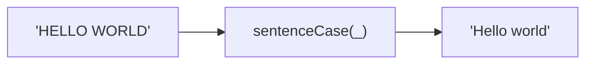
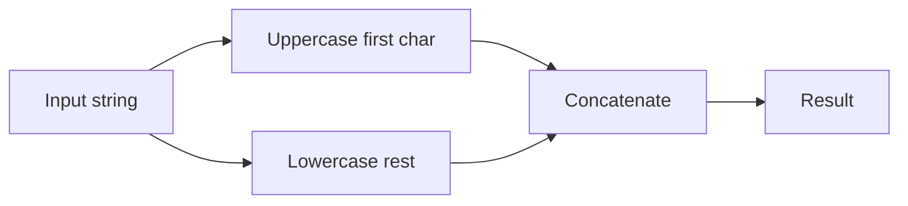

Converts a string to Sentence case.
First character uppercase, rest lowercase.

### Conversion Examples

| Input | Output |
|-------|--------|
| `HELLO WORLD` | `Hello world` |
| `hELLO wORLD` | `Hello world` |
| `hello` | `Hello` |

### Process

