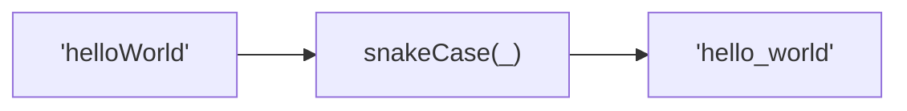
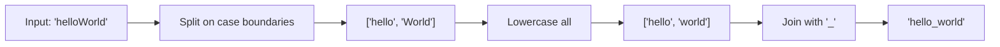

Converts a string to snake_case format.
All lowercase, words separated by underscores.

### Conversion Examples

| Input | Output |
|-------|--------|
| `helloWorld` | `hello_world` |
| `XMLHttpRequest` | `xml_http_request` |
| `hello-world` | `hello_world` |
| `Hello World` | `hello_world` |

### Process

