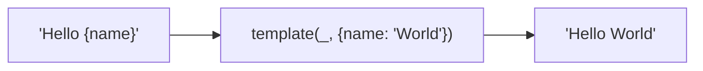
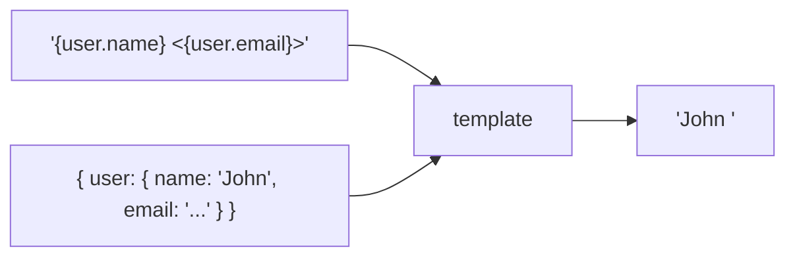
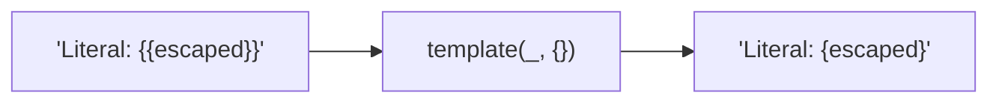
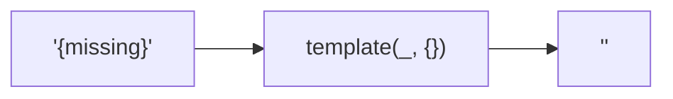

Replaces `{key}` placeholders with values from a data object.
Supports nested paths.

### Nested Paths

### Escape Braces

Use `{{` and `}}` for literal braces.

### Missing Keys

Missing keys become empty strings.
