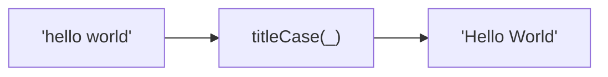
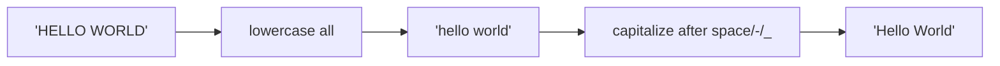

Converts a string to Title Case.
First letter of each word capitalized.

### Conversion Examples

| Input | Output |
|-------|--------|
| `hello world` | `Hello World` |
| `hello-world` | `Hello-World` |
| `HELLO WORLD` | `Hello World` |
| `café résumé` | `Café Résumé` |

### Process

Supports Unicode characters (accents, etc.).
