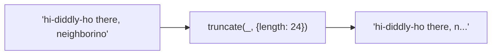
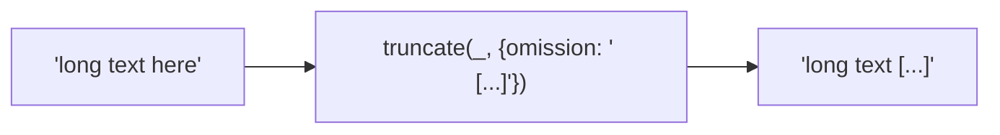

Truncates string to a maximum length with customizable omission.

### Options

| Option | Default | Description |
|--------|---------|-------------|
| `length` | 30 | Max string length |
| `omission` | `'...'` | Truncation indicator |
| `separator` | — | Break at word boundary |

### Word Boundary

Without separator, cuts mid-word. With separator, breaks at last occurrence.

### Custom Omission

