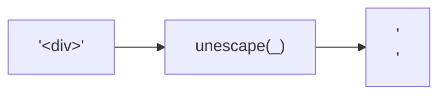
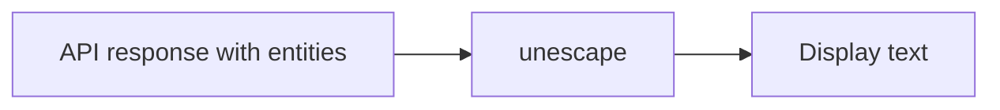

Converts HTML entities back to their corresponding characters.
Inverse of `escape`.

### Entity Mapping

| Entity | Character |
|--------|-----------|
| `&amp;` | `&` |
| `&lt;` | `<` |
| `&gt;` | `>` |
| `&quot;` | `"` |
| `&#39;` | `'` |

### Use Case

