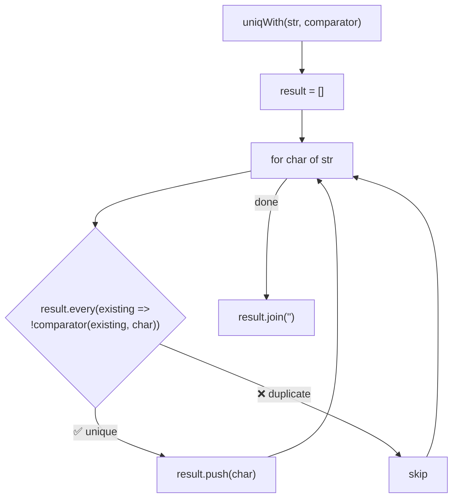
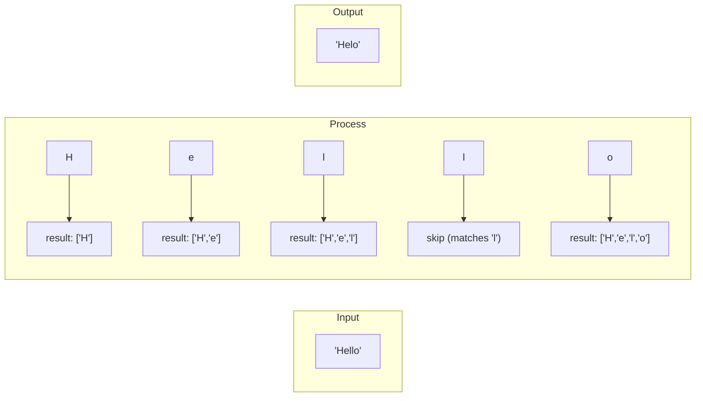

Creates a duplicate-free version of a string using a custom comparator.

### Example: Case-insensitive

### Comparator Examples

| Comparator | Input | Output |
|------------|-------|--------|
| `(a, b) => a === b` | `'hello'` | `'helo'` |
| `(a, b) => a.toLowerCase() === b.toLowerCase()` | `'Hello'` | `'Helo'` |
| `(a, b) => /\s/.test(a) && /\s/.test(b)` | `'a  b  c'` | `'a b c'` |

### Performance

O(n²) time complexity due to `every()` check for each character.
