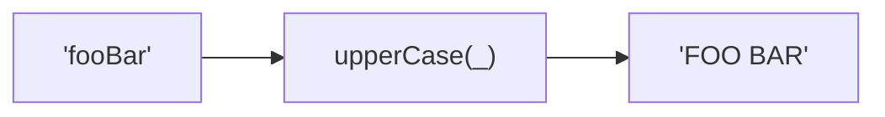
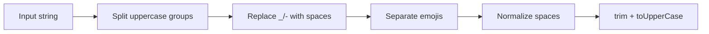

Converts string to space-separated uppercase words.
Splits on case boundaries, underscores, hyphens, and emojis. Supports Unicode.

### Conversion Examples

| Input | Output |
|-------|--------|
| `'--Foo-Bar--'` | `'FOO BAR'` |
| `'fooBar'` | `'FOO BAR'` |
| `'__foo_bar__'` | `'FOO BAR'` |

### Process

