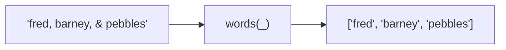
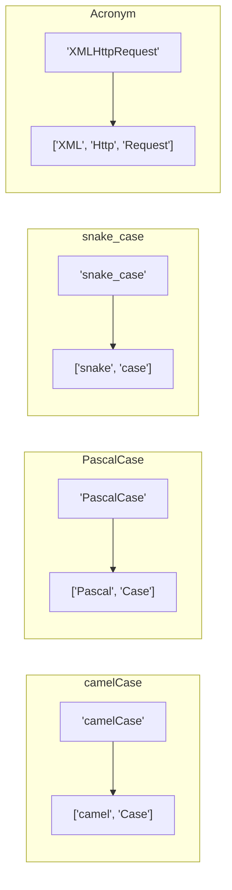
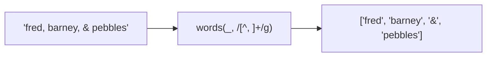

Splits string into an array of its words.
Handles camelCase, PascalCase, snake_case, kebab-case.

```mermaid
flowchart LR
    A["'fred, barney, & pebbles'"] --> B["words(_)"]
    B --> C["['fred', 'barney', 'pebbles']"]
```

### Case Detection

```mermaid
flowchart LR
    subgraph "camelCase"
        A1["'camelCase'"] --> B1["['camel', 'Case']"]
    end
    subgraph "PascalCase"
        A2["'PascalCase'"] --> B2["['Pascal', 'Case']"]
    end
    subgraph "snake_case"
        A3["'snake_case'"] --> B3["['snake', 'case']"]
    end
    subgraph "Acronym"
        A4["'XMLHttpRequest'"] --> B4["['XML', 'Http', 'Request']"]
    end
```

### Custom Pattern

```mermaid
flowchart LR
    A["'fred, barney, & pebbles'"] --> B["words(_, /[^, ]+/g)"]
    B --> C["['fred', 'barney', '&', 'pebbles']"]
```
