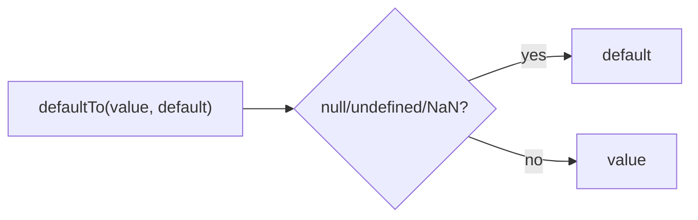
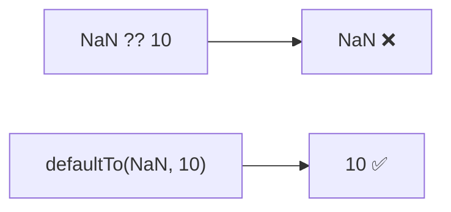

Returns the value if valid, otherwise returns the default value.
Unlike `??`, also handles NaN.

### Comparison with `??`

| Value | `??` | `defaultTo` |
|-------|------|-------------|
| `1` | `1` | `1` |
| `null` | default | default |
| `undefined` | default | default |
| `NaN` | `NaN` ❌ | default ✅ |

### NaN Handling

### Use Case

