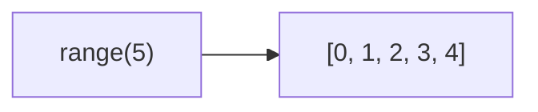
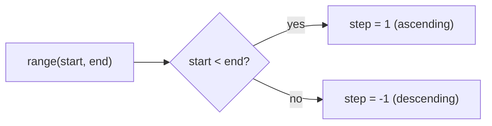
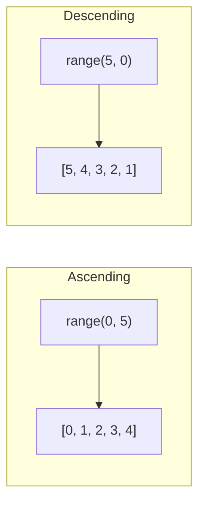

Creates an array of numbers from start up to (but not including) end.

### Signatures

| Call | Result |
|------|--------|
| `range(5)` | `[0, 1, 2, 3, 4]` |
| `range(0, 10, 2)` | `[0, 2, 4, 6, 8]` |
| `range(5, 0)` | `[5, 4, 3, 2, 1]` |
| `range(5, 0, -2)` | `[5, 3, 1]` |

### Direction Detection

### Ascending vs Descending

