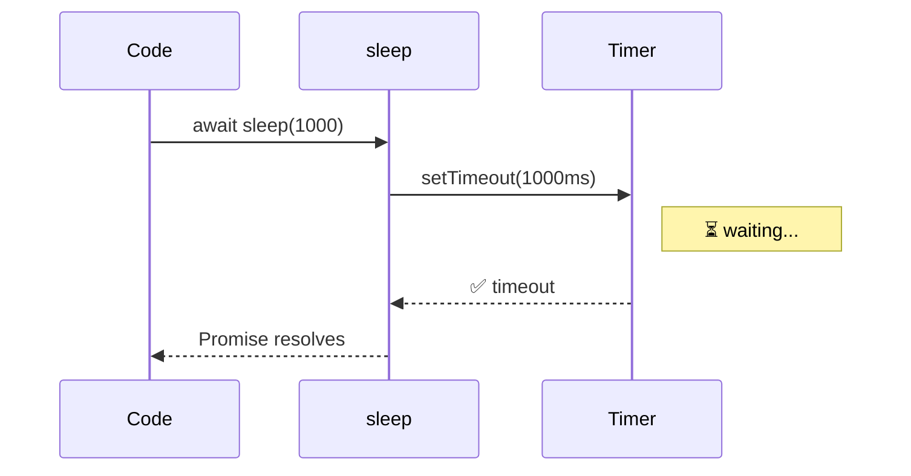
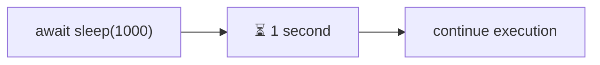
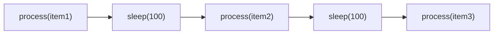

Pauses execution for a specified duration.
Returns a Promise that resolves after the delay.

```mermaid
sequenceDiagram
    participant C as Code
    participant S as sleep
    participant T as Timer
    
    C->>S: await sleep(1000)
    S->>T: setTimeout(1000ms)
    Note right of T: ⏳ waiting...
    T-->>S: ✅ timeout
    S-->>C: Promise resolves
```

### Usage

```mermaid
flowchart LR
    A["await sleep(1000)"] --> B["⏳ 1 second"]
    B --> C["continue execution"]
```

### Sequential Delays

```mermaid
flowchart LR
    A["process(item1)"] --> B["sleep(100)"]
    B --> C["process(item2)"]
    C --> D["sleep(100)"]
    D --> E["process(item3)"]
```

Rate limiting between operations.
