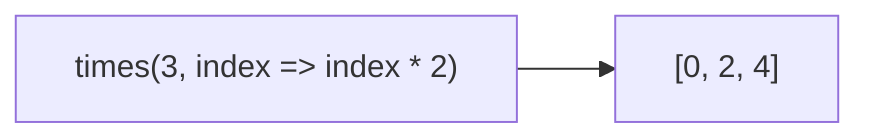
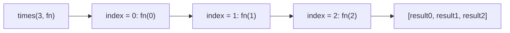
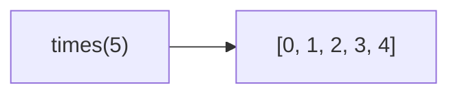

Invokes a function n times, returning an array of results.

### Usage Patterns

| Call | Result |
|------|--------|
| `times(3)` | `[0, 1, 2]` |
| `times(3, index => index * 2)` | `[0, 2, 4]` |
| `times(3, index => 'item-' + index)` | `['item-0', 'item-1', 'item-2']` |
| `times(3, () => 'x')` | `['x', 'x', 'x']` |

### Process

### Without Iteratee

Returns indices when no iteratee is provided.
