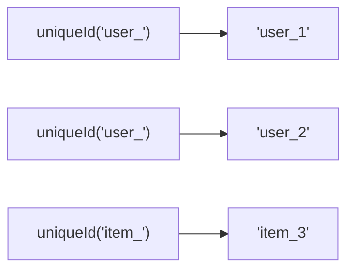
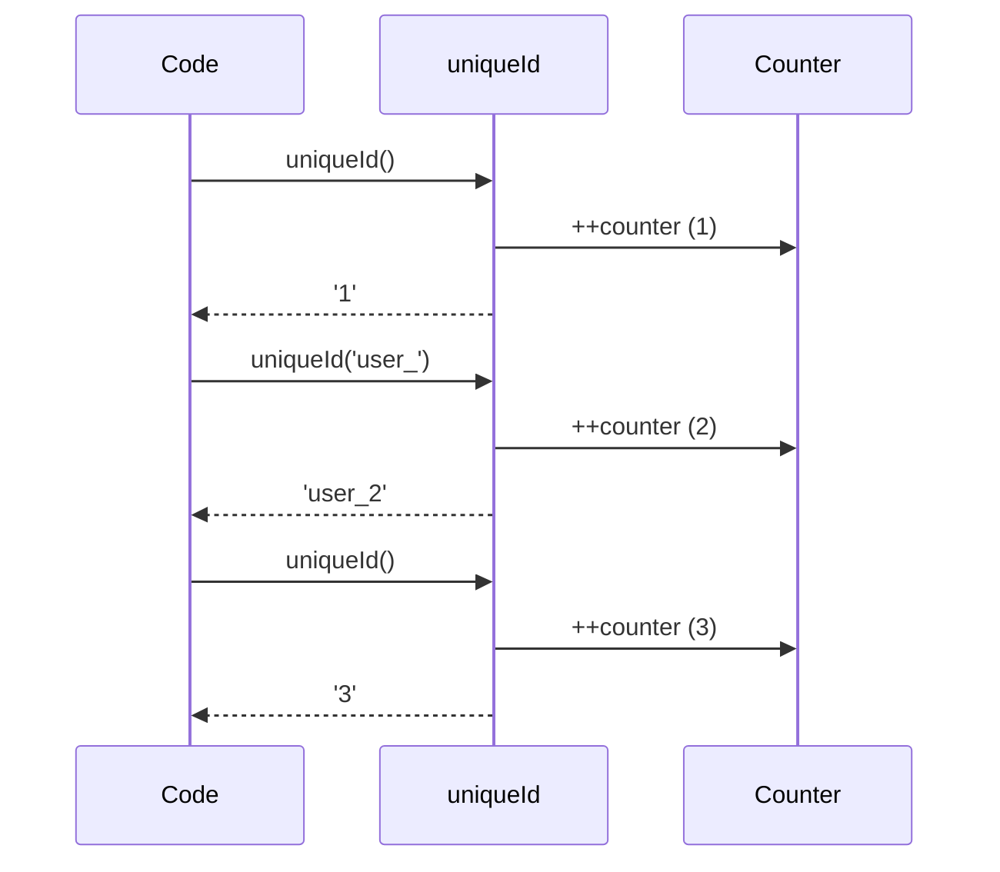
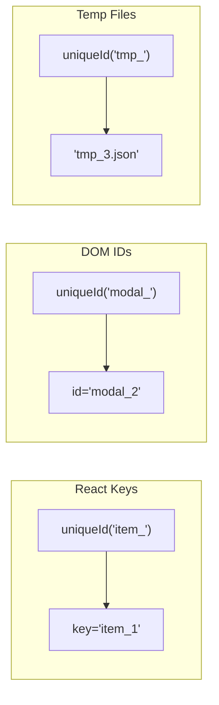

Generates a unique ID, optionally with a prefix.

```mermaid
flowchart LR
    A["uniqueId('user_')"] --> B["'user_1'"]
    C["uniqueId('user_')"] --> D["'user_2'"]
    E["uniqueId('item_')"] --> F["'item_3'"]
```

### Counter Mechanism

```mermaid
sequenceDiagram
    participant C as Code
    participant ID as uniqueId
    participant Counter
    
    C->>ID: uniqueId()
    ID->>Counter: ++counter (1)
    ID-->>C: '1'
    
    C->>ID: uniqueId('user_')
    ID->>Counter: ++counter (2)
    ID-->>C: 'user_2'
    
    C->>ID: uniqueId()
    ID->>Counter: ++counter (3)
    ID-->>C: '3'
```

### Use Cases

```mermaid
flowchart LR
    subgraph "React Keys"
        A1["uniqueId('item_')"] --> B1["key='item_1'"]
    end
    subgraph "DOM IDs"
        A2["uniqueId('modal_')"] --> B2["id='modal_2'"]
    end
    subgraph "Temp Files"
        A3["uniqueId('tmp_')"] --> B3["'tmp_3.json'"]
    end
```

IDs are unique within the current runtime session.
