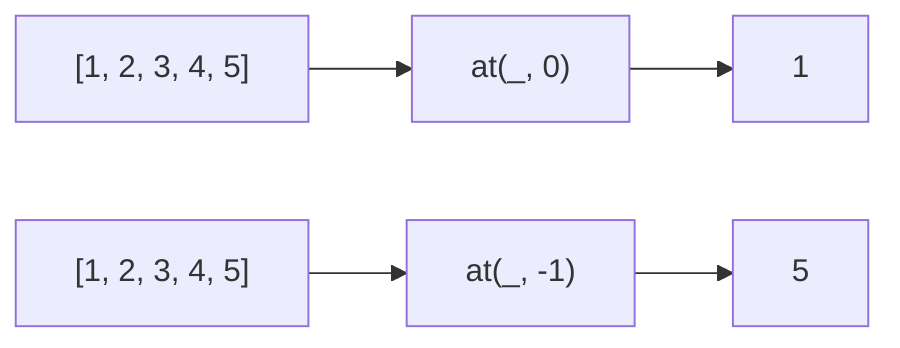
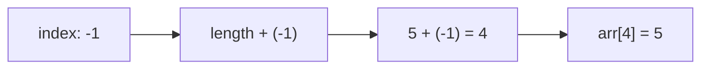

Returns the item at the given index, supporting negative indices.
**Deprecated**: Use `array.at(index)` directly (ES2022).


### Negative Index



### Native Equivalent

```typescript
// ❌ at(arr, -1)
// ✅ arr.at(-1)
```
