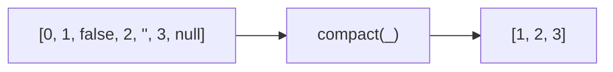

Removes all falsy values from an array.
**Deprecated**: Use `array.filter(Boolean)` directly.


### Falsy Values Removed

| Value | Kept? |
|-------|-------|
| `0` | ❌ |
| `false` | ❌ |
| `''` | ❌ |
| `null` | ❌ |
| `undefined` | ❌ |
| `NaN` | ❌ |
| `1, 2, 3` | ✅ |

### Native Equivalent

```typescript
// ❌ compact(arr)
// ✅ arr.filter(Boolean)
```
