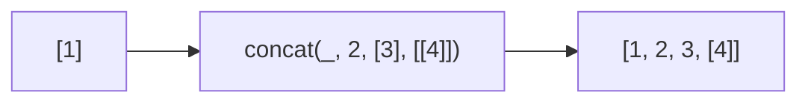

Creates a new array concatenating arrays/values.
**Deprecated**: Use `array.concat()` or spread operator directly.


### Native Equivalent

```typescript
// ❌ concat(arr, 2, [3])
// ✅ arr.concat(2, [3])
// ✅ [...arr, 2, ...other]
```
