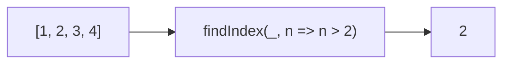

Returns the index of the first element that passes the predicate.
**Deprecated**: Use `array.findIndex()` directly (ES2015).


### Native Equivalent

```typescript
// ❌ findIndex(arr, predicate)
// ✅ arr.findIndex(predicate)
```
