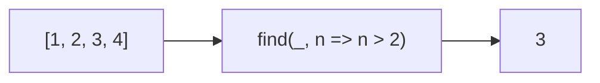

Returns the first element that passes the predicate.
**Deprecated**: Use `array.find()` directly (ES2015).


### Native Equivalent

```typescript
// ❌ find(arr, predicate)
// ✅ arr.find(predicate)
```
