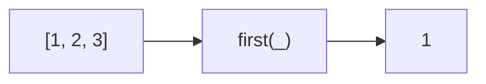

Gets the first element of an array. Alias for `head`.
**Deprecated**: Use `array[0]` or `array.at(0)` directly.


### Native Equivalent

```typescript
// ❌ first(arr)
// ✅ arr[0]
// ✅ arr.at(0)  // ES2022
```
