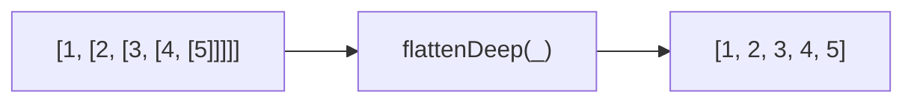
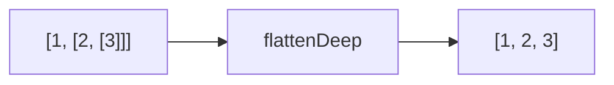

Recursively flattens an array to a single level.
**Deprecated**: Use `array.flat(Infinity)` directly.


### Deep Recursion



### Native Equivalent

```typescript
// ❌ flattenDeep(arr)
// ✅ arr.flat(Infinity)
```
