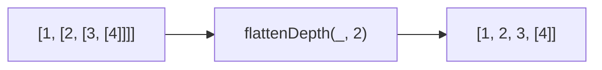

Recursively flattens array up to specified depth.
**Deprecated**: Use `array.flat(depth)` directly (ES2019).

```mermaid
flowchart LR
    A["[1, [2, [3, [4]]]]"] --> B["flattenDepth(_, 2)"]
    B --> C["[1, 2, 3, [4]]"]
```

### Native Equivalent

```typescript
// ❌ flattenDepth(arr, 2)
// ✅ arr.flat(2)
```
