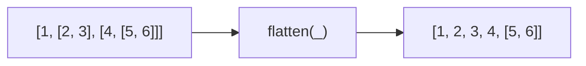
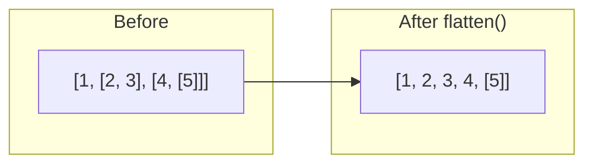

Flattens array a single level deep.
**Deprecated**: Use `array.flat()` directly (ES2019).

```mermaid
flowchart LR
    A["[1, [2, 3], [4, [5, 6]]]"] --> B["flatten(_)"]
    B --> C["[1, 2, 3, 4, [5, 6]]"]
```

### Single Level Only


```mermaid
flowchart LR
    subgraph "Before"
        A["[1, [2, 3], [4, [5]]]"]
    end
    subgraph "After flatten()"
        B["[1, 2, 3, 4, [5]]"]
    end
    A --> B
```

### Native Equivalent

```typescript
// ❌ flatten(arr)
// ✅ arr.flat()
```
