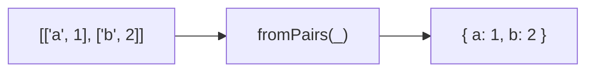

Creates an object from key-value pairs.
**Deprecated**: Use `Object.fromEntries()` directly (ES2019).


### Native Equivalent

```typescript
// ❌ fromPairs(pairs)
// ✅ Object.fromEntries(pairs)
```
