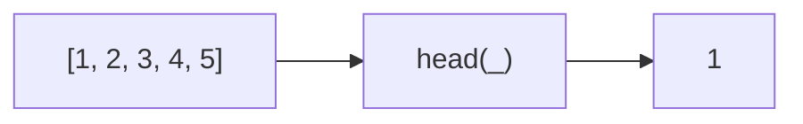
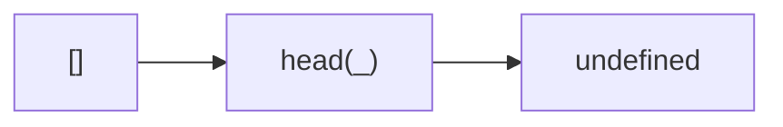

Gets the first element of an array.
**Deprecated**: Use `array[0]` or `array.at(0)` directly.


### Empty Array



### Native Equivalent

```typescript
// ❌ head(arr)
// ✅ arr[0]
// ✅ arr.at(0)
```
