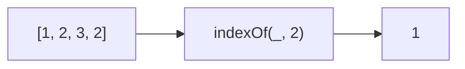

Returns the index of the first occurrence of a value.
**Deprecated**: Use `array.indexOf()` directly.

```mermaid
flowchart LR
    A["[1, 2, 3, 2]"] --> B["indexOf(_, 2)"]
    B --> C["1"]
```

### Native Equivalent

```typescript
// ❌ indexOf(arr, value)
// ✅ arr.indexOf(value)
```
