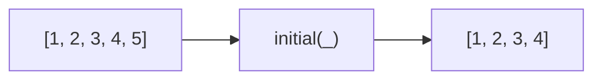

Gets all but the last element of array.
**Deprecated**: Use `array.slice(0, -1)` directly.

```mermaid
flowchart LR
    A["[1, 2, 3, 4, 5]"] --> B["initial(_)"]
    B --> C["[1, 2, 3, 4]"]
```

### Native Equivalent

```typescript
// ❌ initial(arr)
// ✅ arr.slice(0, -1)
```
